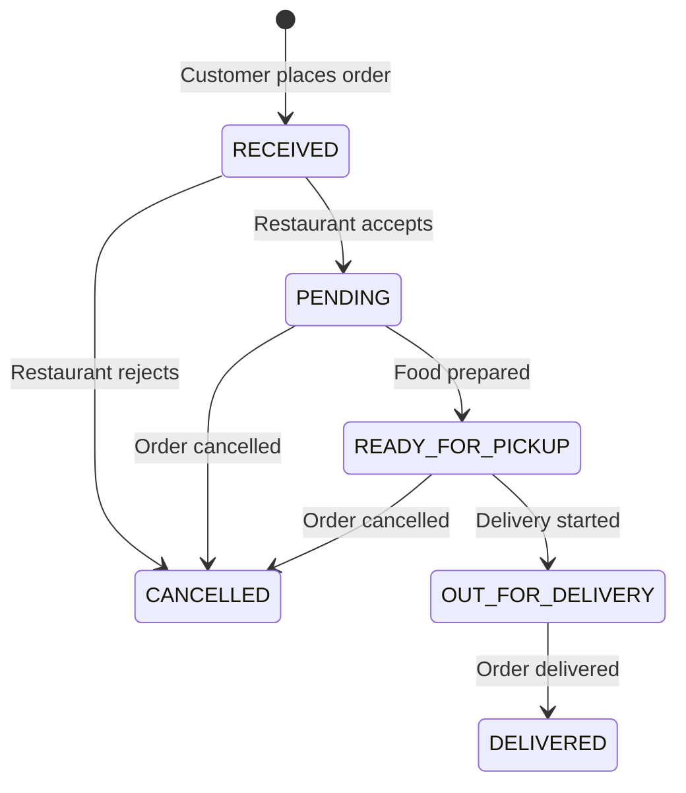

# 🍕 Zosh Food Delivery System - Backend

A comprehensive **Spring Boot** based food delivery platform with multi-tenant restaurant management, secure payment processing, and real-time order tracking.

## 📋 Table of Contents
- [Tech Stack](#tech-stack)
- [System Architecture](#system-architecture)
- [Database Schema](#database-schema)
- [Security Implementation](#security-implementation)
- [API Documentation](#api-documentation)
- [Payment Integration](#payment-integration)
- [Email System](#email-system)
- [Order Management](#order-management)
- [Setup Instructions](#setup-instructions)
- [Interview Q&A](#interview-qa)

---

## 🛠️ Tech Stack

### Core Framework
- **Spring Boot 3.1.3** - Main framework
- **Java 17** - Programming language
- **Maven** - Build tool
- **MySQL** - Primary database

### Security & Authentication
- **Spring Security** - Security framework
- **JWT (JSON Web Tokens)** - Stateless authentication
- **BCrypt** - Password encryption
- **Role-based Access Control** - Multi-level authorization

### Payment Processing
- **Stripe** - International payments
- **Razorpay** - Indian market payments
- **Webhook Integration** - Payment status handling

### Additional Dependencies
```xml
<!-- Key Dependencies -->
<dependency>
    <groupId>org.springframework.boot</groupId>
    <artifactId>spring-boot-starter-data-jpa</artifactId>
</dependency>
<dependency>
    <groupId>org.springframework.boot</groupId>
    <artifactId>spring-boot-starter-security</artifactId>
</dependency>
<dependency>
    <groupId>io.jsonwebtoken</groupId>
    <artifactId>jjwt-api</artifactId>
    <version>0.11.1</version>
</dependency>
<dependency>
    <groupId>com.stripe</groupId>
    <artifactId>stripe-java</artifactId>
    <version>20.62.0</version>
</dependency>
<dependency>
    <groupId>com.razorpay</groupId>
    <artifactId>razorpay-java</artifactId>
    <version>1.4.3</version>
</dependency>
```

---

## 🏗️ System Architecture

### Layered Architecture Pattern

```
┌─────────────────────────────────────┐
│           Frontend (React)          │
├─────────────────────────────────────┤
│          REST API Layer             │
│         (Controllers)               │
├─────────────────────────────────────┤
│        Business Logic Layer        │
│          (Services)                 │
├─────────────────────────────────────┤
│        Data Access Layer           │
│        (Repositories)              │
├─────────────────────────────────────┤
│          Database Layer            │
│           (MySQL)                  │
└─────────────────────────────────────┘
```

### Key Components

#### 1. **Controller Layer** - REST API Endpoints
```java
@RestController
@RequestMapping("/api")
public class RestaurantController {
    // Handle HTTP requests
    // Input validation
    // Response formatting
}
```

#### 2. **Service Layer** - Business Logic
```java
@Service
public class RestaurantServiceImplementation {
    // Business rules
    // Transaction management
    // Data processing
}
```

#### 3. **Repository Layer** - Data Access
```java
public interface UserRepository extends JpaRepository<User, Long> {
    // Database operations
    // Custom queries
    // Entity management
}
```

---

## 🗄️ Database Schema

### Core Entities & Relationships

#### **User Entity**
```java
@Entity
public class User {
    @Id
    private Long id;
    private String fullName;
    private String email;
    private String password;
    private USER_ROLE role;
    
    @OneToMany(mappedBy = "customer")
    private List<Order> orders;
    
    @ElementCollection
    private List<RestaurantDto> favorites;
    
    @OneToMany(cascade = CascadeType.ALL)
    private List<Address> addresses;
}
```

#### **Restaurant Entity**
```java
@Entity
public class Restaurant {
    @Id
    private Long id;
    
    @OneToOne
    private User owner;
    
    private String name;
    private String description;
    private String cuisineType;
    
    @ManyToOne
    private Address address;
    
    @OneToMany(mappedBy = "restaurant")
    private List<Food> foods;
    
    @OneToMany(mappedBy = "restaurant")
    private List<Order> orders;
    
    private LocalDateTime registrationDate;
    private boolean open;
}
```

#### **Order Entity**
```java
@Entity
@Table(name = "orders")
public class Order {
    @Id
    private Long id;
    
    @ManyToOne
    private User customer;
    
    @ManyToOne
    private Restaurant restaurant;
    
    @OneToMany
    private List<OrderItem> items;
    
    @OneToOne
    private Payment payment;
    
    private String orderStatus;
    private Long totalAmount;
    private Date createdAt;
}
```

### **Entity Relationship Diagram**
```
User ||--o{ Order : places
Restaurant ||--o{ Order : receives
Restaurant ||--o{ Food : offers
Order ||--o{ OrderItem : contains
User ||--|| Cart : has
Cart ||--o{ CartItem : contains
Order ||--|| Payment : processes
```

### **User Roles Hierarchy**
```
ROLE_ADMIN
    ├── Can manage all restaurants
    ├── Can view all orders
    └── Can manage all users

ROLE_RESTAURANT_OWNER
    ├── Can manage own restaurant
    ├── Can view own restaurant orders
    └── Can manage menu items

ROLE_RESTAURANT_MANAGER
    ├── Can manage assigned restaurant
    └── Can process orders

ROLE_CUSTOMER
    ├── Can place orders
    ├── Can manage cart
    └── Can view order history
```

---

## 🔐 Authentication & Authorization Deep Dive

### **Authentication vs Authorization Overview**

**Authentication** (Who are you?) - Verifying user identity
**Authorization** (What can you do?) - Determining user permissions

```
┌─────────────────────────────────────────────────────────────┐
│                Authentication Flow                          │
├─────────────────────────────────────────────────────────────┤
│ 1. User Login → 2. Credential Validation → 3. JWT Token    │
│ 4. Token Storage → 5. Token Verification → 6. Access Grant │
└─────────────────────────────────────────────────────────────┘

┌─────────────────────────────────────────────────────────────┐
│                Authorization Flow                           │
├─────────────────────────────────────────────────────────────┤
│ 1. Extract User Roles → 2. Check Permissions → 3. Grant/Deny│
│ 4. Resource Access → 5. Audit Logging → 6. Response Return │
└─────────────────────────────────────────────────────────────┘
```

### **1. User Registration & Authentication**

#### **User Entity with Role-Based Design**
```java
@Entity
@Data
public class User {
    @Id
    @GeneratedValue(strategy = GenerationType.AUTO)
    private Long id;
    
    @Column(unique = true)
    private String email;
    
    @Column(nullable = false)
    private String password; // BCrypt encoded
    
    private String fullName;
    
    @Enumerated(EnumType.STRING)
    private USER_ROLE role;
    
    @Enumerated(EnumType.STRING)
    private UserStatus status = UserStatus.ACTIVE;
    
    @OneToMany(mappedBy = "customer", cascade = CascadeType.ALL)
    @JsonIgnore
    private List<Order> orders;
    
    @ElementCollection
    private List<RestaurantDto> favorites = new ArrayList<>();
    
    @CreationTimestamp
    private LocalDateTime createdAt;
    
    @UpdateTimestamp
    private LocalDateTime updatedAt;
}

// User Role Enumeration
public enum USER_ROLE {
    ROLE_CUSTOMER,           // Can place orders, manage profile
    ROLE_RESTAURANT_OWNER,   // Can manage restaurants, view orders
    ROLE_RESTAURANT_MANAGER, // Can manage assigned restaurant
    ROLE_ADMIN              // Full system access
}

public enum UserStatus {
    ACTIVE,    // User can access system
    PENDING,   // Awaiting email verification
    SUSPENDED, // Temporarily blocked
    BANNED     // Permanently blocked
}
```

#### **Registration Process with Email Verification**
```java
@RestController
@RequestMapping("/auth")
public class AuthController {
    
    @PostMapping("/signup")
    public ResponseEntity<AuthResponse> createUserHandler(
            @Valid @RequestBody UserRegistrationRequest request) throws UserException {
        
        // 1. Input Validation
        validateRegistrationRequest(request);
        
        // 2. Check if email already exists
        User existingUser = userRepository.findByEmail(request.getEmail());
        if (existingUser != null) {
            throw new UserException("Email already registered");
        }
        
        // 3. Create new user with encrypted password
        User newUser = new User();
        newUser.setEmail(request.getEmail());
        newUser.setFullName(request.getFullName());
        newUser.setPassword(passwordEncoder.encode(request.getPassword()));
        newUser.setRole(request.getRole());
        newUser.setStatus(UserStatus.PENDING); // Requires email verification
        
        User savedUser = userRepository.save(newUser);
        
        // 4. Create shopping cart for customer
        if (savedUser.getRole() == USER_ROLE.ROLE_CUSTOMER) {
            Cart cart = new Cart();
            cart.setCustomer(savedUser);
            cartRepository.save(cart);
        }
        
        // 5. Send email verification
        emailService.sendEmailVerification(savedUser);
        
        // 6. Generate authorities based on role
        List<GrantedAuthority> authorities = Collections.singletonList(
            new SimpleGrantedAuthority(savedUser.getRole().toString())
        );
        
        // 7. Create authentication token
        Authentication authentication = new UsernamePasswordAuthenticationToken(
            savedUser.getEmail(), 
            null, 
            authorities
        );
        
        // 8. Generate JWT token
        String jwtToken = jwtProvider.generateToken(authentication);
        
        // 9. Return response
        AuthResponse response = new AuthResponse();
        response.setJwt(jwtToken);
        response.setMessage("Registration successful. Please verify your email.");
        response.setRole(savedUser.getRole());
        response.setStatus(savedUser.getStatus());
        
        return ResponseEntity.ok(response);
    }
    
    private void validateRegistrationRequest(UserRegistrationRequest request) {
        // Email format validation
        if (!isValidEmail(request.getEmail())) {
            throw new ValidationException("Invalid email format");
        }
        
        // Password strength validation
        if (!isStrongPassword(request.getPassword())) {
            throw new ValidationException("Password must contain at least 8 characters, including uppercase, lowercase, number, and special character");
        }
        
        // Full name validation
        if (request.getFullName() == null || request.getFullName().trim().isEmpty()) {
            throw new ValidationException("Full name is required");
        }
    }
}
```

#### **Login Authentication Process**
```java
@PostMapping("/signin")
public ResponseEntity<AuthResponse> signin(@RequestBody LoginRequest loginRequest) {
    
    // 1. Extract credentials
    String email = loginRequest.getEmail();
    String password = loginRequest.getPassword();
    
    // 2. Authenticate user
    Authentication authentication = authenticate(email, password);
    
    // 3. Set security context
    SecurityContextHolder.getContext().setAuthentication(authentication);
    
    // 4. Generate JWT token
    String jwtToken = jwtProvider.generateToken(authentication);
    
    // 5. Get user authorities
    Collection<? extends GrantedAuthority> authorities = authentication.getAuthorities();
    String roleName = authorities.isEmpty() ? null : 
        authorities.iterator().next().getAuthority();
    
    // 6. Build response
    AuthResponse authResponse = new AuthResponse();
    authResponse.setJwt(jwtToken);
    authResponse.setMessage("Login successful");
    authResponse.setRole(USER_ROLE.valueOf(roleName));
    
    // 7. Log successful authentication
    auditService.logSuccessfulLogin(email, getClientIP());
    
    return ResponseEntity.ok(authResponse);
}

private Authentication authenticate(String email, String password) {
    // 1. Load user details
    UserDetails userDetails = customUserDetailsService.loadUserByUsername(email);
    
    if (userDetails == null) {
        auditService.logFailedLogin(email, "User not found", getClientIP());
        throw new BadCredentialsException("Invalid email or password");
    }
    
    // 2. Check account status
    User user = userRepository.findByEmail(email);
    if (user.getStatus() != UserStatus.ACTIVE) {
        auditService.logFailedLogin(email, "Account not active", getClientIP());
        throw new AccountStatusException("Account is " + user.getStatus());
    }
    
    // 3. Validate password
    if (!passwordEncoder.matches(password, userDetails.getPassword())) {
        auditService.logFailedLogin(email, "Invalid password", getClientIP());
        
        // Implement account lockout after failed attempts
        failedLoginAttemptService.recordFailedAttempt(email);
        
        throw new BadCredentialsException("Invalid email or password");
    }
    
    // 4. Check for account lockout
    if (failedLoginAttemptService.isAccountLocked(email)) {
        throw new AccountLockedException("Account temporarily locked due to multiple failed attempts");
    }
    
    // 5. Reset failed attempts on successful login
    failedLoginAttemptService.resetFailedAttempts(email);
    
    return new UsernamePasswordAuthenticationToken(
        userDetails, null, userDetails.getAuthorities()
    );
}
```

### **2. JWT Token Implementation**

#### **JWT Provider Service**
```java
@Service
public class JwtProvider {
    
    // Use environment variable in production
    private SecretKey key = Keys.hmacShaKeyFor(JwtConstant.SECRET_KEY.getBytes());
    
    private static final long JWT_EXPIRATION = 86400000; // 24 hours
    private static final long REFRESH_EXPIRATION = 604800000; // 7 days
    
    public String generateToken(Authentication auth) {
        Collection<? extends GrantedAuthority> authorities = auth.getAuthorities();
        String roles = populateAuthorities(authorities);
        
        return Jwts.builder()
            .setSubject(auth.getName()) // Email as subject
            .setIssuedAt(new Date())
            .setExpiration(new Date(System.currentTimeMillis() + JWT_EXPIRATION))
            .claim("email", auth.getName())
            .claim("authorities", roles)
            .claim("tokenType", "ACCESS_TOKEN")
            .claim("jti", UUID.randomUUID().toString()) // Unique token ID
            .signWith(key, SignatureAlgorithm.HS512)
            .compact();
    }
    
    public String generateRefreshToken(Authentication auth) {
        return Jwts.builder()
            .setSubject(auth.getName())
            .setIssuedAt(new Date())
            .setExpiration(new Date(System.currentTimeMillis() + REFRESH_EXPIRATION))
            .claim("email", auth.getName())
            .claim("tokenType", "REFRESH_TOKEN")
            .claim("jti", UUID.randomUUID().toString())
            .signWith(key, SignatureAlgorithm.HS512)
            .compact();
    }
    
    public String getEmailFromJwtToken(String jwt) {
        // Remove "Bearer " prefix
        if (jwt.startsWith("Bearer ")) {
            jwt = jwt.substring(7);
        }
        
        Claims claims = Jwts.parserBuilder()
            .setSigningKey(key)
            .build()
            .parseClaimsJws(jwt)
            .getBody();
            
        return String.valueOf(claims.get("email"));
    }
    
    public boolean validateToken(String token) {
        try {
            Claims claims = Jwts.parserBuilder()
                .setSigningKey(key)
                .build()
                .parseClaimsJws(token)
                .getBody();
                
            // Check if token is blacklisted
            String jti = (String) claims.get("jti");
            if (tokenBlacklistService.isTokenBlacklisted(jti)) {
                return false;
            }
            
            return true;
        } catch (JwtException | IllegalArgumentException e) {
            return false;
        }
    }
    
    public String populateAuthorities(Collection<? extends GrantedAuthority> authorities) {
        Set<String> auths = new HashSet<>();
        for (GrantedAuthority authority : authorities) {
            auths.add(authority.getAuthority());
        }
        return String.join(",", auths);
    }
}
```

#### **JWT Token Validator Filter**
```java
public class JwtTokenValidator extends OncePerRequestFilter {
    
    @Autowired
    private JwtProvider jwtProvider;
    
    @Autowired
    private UserService userService;
    
    @Override
    protected void doFilterInternal(
            HttpServletRequest request,
            HttpServletResponse response,
            FilterChain filterChain) throws ServletException, IOException {
        
        String jwt = request.getHeader(JwtConstant.JWT_HEADER);
        
        if (jwt != null && jwt.startsWith("Bearer ")) {
            jwt = jwt.substring(7); // Remove "Bearer " prefix
            
            try {
                // 1. Validate token structure and signature
                if (!jwtProvider.validateToken(jwt)) {
                    filterChain.doFilter(request, response);
                    return;
                }
                
                // 2. Extract claims
                SecretKey key = Keys.hmacShaKeyFor(JwtConstant.SECRET_KEY.getBytes());
                Claims claims = Jwts.parserBuilder()
                    .setSigningKey(key)
                    .build()
                    .parseClaimsJws(jwt)
                    .getBody();
                
                String email = String.valueOf(claims.get("email"));
                String authorities = String.valueOf(claims.get("authorities"));
                
                // 3. Verify user still exists and is active
                User user = userService.findUserByEmail(email);
                if (user == null || user.getStatus() != UserStatus.ACTIVE) {
                    throw new BadCredentialsException("User account not found or inactive");
                }
                
                // 4. Create authentication object
                List<GrantedAuthority> auths = AuthorityUtils
                    .commaSeparatedStringToAuthorityList(authorities);
                    
                Authentication authentication = new UsernamePasswordAuthenticationToken(
                    email, null, auths
                );
                
                // 5. Set security context
                SecurityContextHolder.getContext().setAuthentication(authentication);
                
                // 6. Log access for audit
                auditService.logTokenAccess(email, request.getRequestURI(), 
                    request.getMethod(), getClientIP(request));
                
            } catch (ExpiredJwtException e) {
                response.setStatus(HttpStatus.UNAUTHORIZED.value());
                response.getWriter().write("{\"error\":\"Token expired\"}");
                return;
            } catch (Exception e) {
                response.setStatus(HttpStatus.UNAUTHORIZED.value());
                response.getWriter().write("{\"error\":\"Invalid token\"}");
                return;
            }
        }
        
        filterChain.doFilter(request, response);
    }
    
    private String getClientIP(HttpServletRequest request) {
        String xForwardedFor = request.getHeader("X-Forwarded-For");
        if (xForwardedFor != null && !xForwardedFor.isEmpty()) {
            return xForwardedFor.split(",")[0].trim();
        }
        return request.getRemoteAddr();
    }
}
```

### **3. Role-Based Authorization**

#### **Security Configuration with Role Mapping**
```java
@Configuration
@EnableWebSecurity
@EnableMethodSecurity(prePostEnabled = true) // Enable method-level security
public class AppConfig {
    
    @Bean
    SecurityFilterChain securityFilterChain(HttpSecurity http) throws Exception {
        return http
            .sessionManagement(management -> 
                management.sessionCreationPolicy(SessionCreationPolicy.STATELESS))
            .authorizeHttpRequests(authorize -> authorize
                // Public endpoints
                .requestMatchers("/auth/**").permitAll()
                .requestMatchers("/api/restaurants/search").permitAll()
                .requestMatchers("/api/restaurants").permitAll()
                .requestMatchers("/health", "/actuator/**").permitAll()
                
                // Admin endpoints
                .requestMatchers("/api/admin/**")
                    .hasAnyRole("ADMIN", "RESTAURANT_OWNER")
                .requestMatchers("/api/superadmin/**")
                    .hasRole("ADMIN")
                
                // Restaurant owner endpoints
                .requestMatchers(HttpMethod.POST, "/api/restaurants")
                    .hasRole("RESTAURANT_OWNER")
                .requestMatchers(HttpMethod.PUT, "/api/restaurants/**")
                    .hasRole("RESTAURANT_OWNER")
                
                // Customer endpoints
                .requestMatchers("/api/orders/**")
                    .hasAnyRole("CUSTOMER", "RESTAURANT_OWNER", "ADMIN")
                .requestMatchers("/api/cart/**")
                    .hasRole("CUSTOMER")
                
                // All other API endpoints require authentication
                .requestMatchers("/api/**").authenticated()
                .anyRequest().permitAll())
            
            .addFilterBefore(new JwtTokenValidator(), BasicAuthenticationFilter.class)
            .csrf(csrf -> csrf.disable())
            .cors(cors -> cors.configurationSource(corsConfigurationSource()))
            .exceptionHandling(exceptions -> exceptions
                .authenticationEntryPoint(new CustomAuthenticationEntryPoint())
                .accessDeniedHandler(new CustomAccessDeniedHandler()))
            .build();
    }
    
    // CORS Configuration for frontend integration
    private CorsConfigurationSource corsConfigurationSource() {
        return new CorsConfigurationSource() {
            @Override
            public CorsConfiguration getCorsConfiguration(HttpServletRequest request) {
                CorsConfiguration cfg = new CorsConfiguration();
                cfg.setAllowedOrigins(Arrays.asList(
                    "http://localhost:3000",     // React development
                    "https://zosh-food.vercel.app", // Production frontend
                    "http://localhost:4200"      // Angular development
                ));
                cfg.setAllowedMethods(Arrays.asList("GET", "POST", "PUT", "DELETE", "OPTIONS"));
                cfg.setAllowCredentials(true);
                cfg.setAllowedHeaders(Arrays.asList("*"));
                cfg.setExposedHeaders(Arrays.asList("Authorization"));
                cfg.setMaxAge(3600L);
                return cfg;
            }
        };
    }
}
```

#### **Method-Level Security**
```java
@Service
public class RestaurantService {
    
    // Only restaurant owners can create restaurants
    @PreAuthorize("hasRole('RESTAURANT_OWNER')")
    public Restaurant createRestaurant(CreateRestaurantRequest request) {
        User currentUser = getCurrentUser();
        
        // Additional business logic: Owner can only create one restaurant
        if (restaurantRepository.existsByOwnerId(currentUser.getId())) {
            throw new BusinessException("Owner already has a restaurant");
        }
        
        Restaurant restaurant = new Restaurant();
        restaurant.setOwner(currentUser);
        restaurant.setName(request.getName());
        restaurant.setStatus(RestaurantStatus.PENDING_APPROVAL);
        
        return restaurantRepository.save(restaurant);
    }
    
    // Only restaurant owner or admin can update restaurant
    @PreAuthorize("hasRole('ADMIN') or (hasRole('RESTAURANT_OWNER') and @restaurantService.isOwner(#restaurantId, authentication.name))")
    public Restaurant updateRestaurant(Long restaurantId, UpdateRestaurantRequest request) {
        Restaurant restaurant = findRestaurantById(restaurantId);
        
        // Update fields
        restaurant.setName(request.getName());
        restaurant.setDescription(request.getDescription());
        restaurant.setCuisineType(request.getCuisineType());
        
        return restaurantRepository.save(restaurant);
    }
    
    // Check if user is owner of restaurant
    public boolean isOwner(Long restaurantId, String email) {
        Restaurant restaurant = restaurantRepository.findById(restaurantId)
            .orElse(null);
        return restaurant != null && 
               restaurant.getOwner().getEmail().equals(email);
    }
    
    // Only customers can add to favorites
    @PreAuthorize("hasRole('CUSTOMER')")
    public RestaurantDto addToFavorites(Long restaurantId, User user) {
        Restaurant restaurant = findRestaurantById(restaurantId);
        
        RestaurantDto restaurantDto = new RestaurantDto();
        restaurantDto.setId(restaurant.getId());
        restaurantDto.setName(restaurant.getName());
        restaurantDto.setImages(restaurant.getImages());
        restaurantDto.setDescription(restaurant.getDescription());
        
        // Add to user's favorites
        user.getFavorites().add(restaurantDto);
        userRepository.save(user);
        
        return restaurantDto;
    }
}

@Service
public class OrderService {
    
    // Customers can only view their own orders
    @PreAuthorize("hasRole('CUSTOMER')")
    @PostFilter("filterObject.customer.email == authentication.name")
    public List<Order> getUserOrders() {
        User currentUser = getCurrentUser();
        return orderRepository.findByCustomerIdOrderByCreatedAtDesc(currentUser.getId());
    }
    
    // Restaurant owners can only view orders for their restaurant
    @PreAuthorize("hasRole('RESTAURANT_OWNER')")
    public List<Order> getRestaurantOrders(Long restaurantId) {
        User currentUser = getCurrentUser();
        
        // Verify ownership
        Restaurant restaurant = restaurantRepository.findById(restaurantId)
            .orElseThrow(() -> new RestaurantNotFoundException());
            
        if (!restaurant.getOwner().getId().equals(currentUser.getId())) {
            throw new AccessDeniedException("Not authorized to view these orders");
        }
        
        return orderRepository.findByRestaurantIdOrderByCreatedAtDesc(restaurantId);
    }
    
    // Only restaurant owner or admin can update order status
    @PreAuthorize("hasRole('ADMIN') or (hasRole('RESTAURANT_OWNER') and @orderService.canUpdateOrder(#orderId, authentication.name))")
    public Order updateOrderStatus(Long orderId, OrderStatus newStatus) {
        Order order = findOrderById(orderId);
        
        // Business logic for status transitions
        validateStatusTransition(order.getOrderStatus(), newStatus);
        
        order.setOrderStatus(newStatus.toString());
        order.setUpdatedAt(LocalDateTime.now());
        
        Order updatedOrder = orderRepository.save(order);
        
        // Send notification to customer
        notificationService.sendOrderStatusUpdate(updatedOrder);
        
        return updatedOrder;
    }
    
    public boolean canUpdateOrder(Long orderId, String email) {
        Order order = orderRepository.findById(orderId).orElse(null);
        return order != null && 
               order.getRestaurant().getOwner().getEmail().equals(email);
    }
}
```

#### **Custom Security Expressions**
```java
@Component("securityService")
public class CustomSecurityService {
    
    @Autowired
    private RestaurantRepository restaurantRepository;
    
    @Autowired
    private OrderRepository orderRepository;
    
    // Check if user owns the restaurant
    public boolean isRestaurantOwner(Long restaurantId, String email) {
        return restaurantRepository.findById(restaurantId)
            .map(restaurant -> restaurant.getOwner().getEmail().equals(email))
            .orElse(false);
    }
    
    // Check if user can access order
    public boolean canAccessOrder(Long orderId, String email) {
        return orderRepository.findById(orderId)
            .map(order -> {
                // Customer can access their own orders
                if (order.getCustomer().getEmail().equals(email)) {
                    return true;
                }
                // Restaurant owner can access orders for their restaurant
                return order.getRestaurant().getOwner().getEmail().equals(email);
            })
            .orElse(false);
    }
    
    // Check if user can modify menu item
    public boolean canModifyMenuItem(Long menuItemId, String email) {
        return foodRepository.findById(menuItemId)
            .map(food -> food.getRestaurant().getOwner().getEmail().equals(email))
            .orElse(false);
    }
}

// Usage in controllers
@RestController
@RequestMapping("/api/admin/orders")
public class AdminOrderController {
    
    @GetMapping("/{orderId}")
    @PreAuthorize("@securityService.canAccessOrder(#orderId, authentication.name)")
    public ResponseEntity<Order> getOrderById(@PathVariable Long orderId) {
        Order order = orderService.findOrderById(orderId);
        return ResponseEntity.ok(order);
    }
    
    @PutMapping("/{orderId}/status")
    @PreAuthorize("@securityService.canAccessOrder(#orderId, authentication.name)")
    public ResponseEntity<Order> updateOrderStatus(
            @PathVariable Long orderId,
            @RequestBody UpdateOrderStatusRequest request) {
        Order order = orderService.updateOrderStatus(orderId, request.getStatus());
        return ResponseEntity.ok(order);
    }
}
```

### **4. Security Auditing & Monitoring**

#### **Security Audit Service**
```java
@Entity
@Table(name = "security_audit_log")
public class SecurityAuditLog {
    @Id
    @GeneratedValue(strategy = GenerationType.IDENTITY)
    private Long id;
    
    private String username;
    private String action;          // LOGIN, LOGOUT, ACCESS_DENIED, TOKEN_REFRESH
    private String resource;        // API endpoint accessed
    private String ipAddress;
    private String userAgent;
    private LocalDateTime timestamp;
    private String result;          // SUCCESS, FAILURE
    private String details;         // Additional context
    private String riskLevel;       // LOW, MEDIUM, HIGH
}

@Service
public class SecurityAuditService {
    
    @Autowired
    private SecurityAuditLogRepository auditRepository;
    
    @Async
    public void logSuccessfulLogin(String email, String ipAddress) {
        SecurityAuditLog log = new SecurityAuditLog();
        log.setUsername(email);
        log.setAction("LOGIN");
        log.setIpAddress(ipAddress);
        log.setTimestamp(LocalDateTime.now());
        log.setResult("SUCCESS");
        log.setRiskLevel("LOW");
        
        auditRepository.save(log);
    }
    
    @Async
    public void logFailedLogin(String email, String reason, String ipAddress) {
        SecurityAuditLog log = new SecurityAuditLog();
        log.setUsername(email);
        log.setAction("LOGIN_FAILED");
        log.setIpAddress(ipAddress);
        log.setTimestamp(LocalDateTime.now());
        log.setResult("FAILURE");
        log.setDetails(reason);
        log.setRiskLevel(determineRiskLevel(email, ipAddress));
        
        auditRepository.save(log);
        
        // Alert on high-risk activities
        if ("HIGH".equals(log.getRiskLevel())) {
            alertingService.sendSecurityAlert(log);
        }
    }
    
    @Async
    public void logTokenAccess(String email, String resource, String method, String ipAddress) {
        SecurityAuditLog log = new SecurityAuditLog();
        log.setUsername(email);
        log.setAction("API_ACCESS");
        log.setResource(method + " " + resource);
        log.setIpAddress(ipAddress);
        log.setTimestamp(LocalDateTime.now());
        log.setResult("SUCCESS");
        log.setRiskLevel("LOW");
        
        auditRepository.save(log);
    }
    
    private String determineRiskLevel(String email, String ipAddress) {
        // Check for multiple failed attempts
        long recentFailures = auditRepository.countFailedLoginAttempts(
            email, LocalDateTime.now().minusMinutes(15)
        );
        
        if (recentFailures >= 5) {
            return "HIGH";
        } else if (recentFailures >= 3) {
            return "MEDIUM";
        }
        
        return "LOW";
    }
}
```

### **5. Password Security & Reset**

#### **Password Reset Implementation**
```java
@Entity
public class PasswordResetToken {
    @Id
    @GeneratedValue(strategy = GenerationType.IDENTITY)
    private Long id;
    
    private String token;
    
    @OneToOne(targetEntity = User.class, fetch = FetchType.EAGER)
    @JoinColumn(nullable = false, name = "user_id")
    private User user;
    
    private Date expiryDate;
    
    public boolean isExpired() {
        return new Date().after(this.expiryDate);
    }
}

@Service
public class PasswordResetService {
    
    @Autowired
    private PasswordResetTokenRepository tokenRepository;
    
    @Autowired
    private UserRepository userRepository;
    
    @Autowired
    private EmailService emailService;
    
    @Autowired
    private PasswordEncoder passwordEncoder;
    
    public void initiatePasswordReset(String email) {
        User user = userRepository.findByEmail(email);
        if (user == null) {
            // Don't reveal if email exists for security
            return;
        }
        
        // Generate secure token
        String token = generateSecureToken();
        
        // Calculate expiry (10 minutes)
        Calendar calendar = Calendar.getInstance();
        calendar.add(Calendar.MINUTE, 10);
        Date expiryDate = calendar.getTime();
        
        // Save token
        PasswordResetToken resetToken = new PasswordResetToken();
        resetToken.setToken(token);
        resetToken.setUser(user);
        resetToken.setExpiryDate(expiryDate);
        
        tokenRepository.save(resetToken);
        
        // Send email
        emailService.sendPasswordResetEmail(user.getEmail(), token);
        
        // Log security event
        auditService.logPasswordResetInitiated(email);
    }
    
    public void resetPassword(String token, String newPassword) {
        PasswordResetToken resetToken = tokenRepository.findByToken(token);
        
        if (resetToken == null || resetToken.isExpired()) {
            throw new SecurityException("Invalid or expired reset token");
        }
        
        // Validate new password strength
        if (!isStrongPassword(newPassword)) {
            throw new ValidationException("Password does not meet security requirements");
        }
        
        // Update password
        User user = resetToken.getUser();
        user.setPassword(passwordEncoder.encode(newPassword));
        userRepository.save(user);
        
        // Delete used token
        tokenRepository.delete(resetToken);
        
        // Log security event
        auditService.logPasswordReset(user.getEmail());
        
        // Send confirmation email
        emailService.sendPasswordChangeConfirmation(user.getEmail());
    }
    
    private String generateSecureToken() {
        return UUID.randomUUID().toString() + UUID.randomUUID().toString();
    }
    
    private boolean isStrongPassword(String password) {
        // At least 8 characters, contains uppercase, lowercase, number, special char
        return password.length() >= 8 &&
               password.matches(".*[A-Z].*") &&
               password.matches(".*[a-z].*") &&
               password.matches(".*[0-9].*") &&
               password.matches(".*[!@#$%^&*()_+\\-=\\[\\]{};':\"\\\\|,.<>\\/?].*");
    }
}
```

### **Security Configuration Summary**
- ✅ **Stateless JWT Authentication** with configurable expiry
- ✅ **Role-Based Access Control** (RBAC) with granular permissions
- ✅ **Method-Level Security** using Spring Security annotations
- ✅ **Password Security** with BCrypt encoding and strength validation
- ✅ **Token-Based Password Reset** with secure token generation
- ✅ **Security Auditing** with comprehensive logging
- ✅ **Account Protection** with failed attempt tracking
- ✅ **CORS Configuration** for cross-origin requests

---

## 📡 API Documentation

### Authentication Endpoints

#### **POST** `/auth/signup`
```json
{
  "fullName": "John Doe",
  "email": "john@example.com",
  "password": "securePassword",
  "role": "ROLE_CUSTOMER"
}
```

**Response:**
```json
{
  "jwt": "eyJhbGciOiJIUzI1NiIsInR5cCI6IkpXVCJ9...",
  "message": "Register Success",
  "role": "ROLE_CUSTOMER"
}
```

#### **POST** `/auth/signin`
```json
{
  "email": "john@example.com",
  "password": "securePassword"
}
```

### Restaurant Endpoints

#### **GET** `/api/restaurants`
- **Purpose**: Get all restaurants
- **Auth**: Required
- **Response**: Array of restaurant objects

#### **GET** `/api/restaurants/search?keyword={name}`
- **Purpose**: Search restaurants by name
- **Auth**: Required
- **Response**: Filtered restaurant array

#### **PUT** `/api/restaurants/{id}/add-favorites`
- **Purpose**: Add restaurant to user favorites
- **Auth**: Required (JWT header)
- **Response**: Updated restaurant DTO

### Order Management Endpoints

#### **POST** `/api/orders`
```json
{
  "restaurantId": 1,
  "deliveryAddress": {
    "street": "123 Main St",
    "city": "New York",
    "state": "NY",
    "zipCode": "10001"
  }
}
```

#### **GET** `/api/orders/user`
- **Purpose**: Get user's order history
- **Auth**: Required (JWT header)
- **Response**: Array of user orders

### Admin Endpoints

#### **GET** `/api/admin/restaurants`
- **Purpose**: Get all restaurants (admin view)
- **Auth**: Required (ADMIN/RESTAURANT_OWNER role)

#### **PUT** `/api/admin/orders/{orderId}/status`
```json
{
  "orderStatus": "READY_FOR_PICKUP"
}
```

---

## 💳 Payment Integration

### Dual Payment Gateway Architecture

```java
@Service
public class PaymentServiceImplementation {
    
    // Stripe for International Payments
    public PaymentResponse createStripePayment(PaymentRequest req) {
        Stripe.apiKey = stripeSecretKey;
        
        SessionCreateParams params = SessionCreateParams.builder()
            .setMode(SessionCreateParams.Mode.PAYMENT)
            .setSuccessUrl(req.getSuccessUrl())
            .setCancelUrl(req.getCancelUrl())
            .addLineItem(lineItem)
            .build();
            
        Session session = Session.create(params);
        return new PaymentResponse(session.getUrl());
    }
    
    // Razorpay for Indian Market
    public PaymentResponse createRazorpayPayment(PaymentRequest req) {
        RazorpayClient razorpay = new RazorpayClient(keyId, keySecret);
        
        JSONObject orderRequest = new JSONObject();
        orderRequest.put("amount", req.getAmount() * 100); // Convert to paise
        orderRequest.put("currency", "INR");
        
        com.razorpay.Order order = razorpay.orders.create(orderRequest);
        return new PaymentResponse(order.get("id"));
    }
}
```

### Payment Flow

```
1. Order Creation
   ↓
2. Payment Gateway Selection (Stripe/Razorpay)
   ↓
3. Payment Link Generation
   ↓
4. Customer Redirection
   ↓
5. Payment Processing
   ↓
6. Webhook/Callback Handling
   ↓
7. Order Status Update
   ↓
8. Email Notification
```

### Payment Response Handling

```java
@PostMapping("/webhook/stripe")
public ResponseEntity<String> handleStripeWebhook(
    @RequestBody String payload,
    @RequestHeader("Stripe-Signature") String sigHeader) {
    
    Event event = Webhook.constructEvent(payload, sigHeader, endpointSecret);
    
    if ("checkout.session.completed".equals(event.getType())) {
        // Update order status to PAID
        // Send confirmation email
        // Notify restaurant
    }
    
    return ResponseEntity.ok("Success");
}
```

---

## 📧 Email System

### Email Service Implementation

```java
@Service
public class EmailService {
    
    @Autowired
    private JavaMailSender javaMailSender;
    
    public void sendPasswordResetEmail(User user) {
        String resetToken = generateRandomToken();
        Date expiryDate = calculateExpiryDate(); // 10 minutes
        
        PasswordResetToken token = new PasswordResetToken(resetToken, user, expiryDate);
        passwordResetTokenRepository.save(token);
        
        String resetUrl = "http://localhost:3000/account/reset-password?token=" + resetToken;
        sendEmail(user.getEmail(), "Password Reset", resetUrl);
    }
    
    public void sendOrderConfirmation(Order order) {
        String subject = "Order Confirmation #" + order.getId();
        String message = buildOrderConfirmationTemplate(order);
        sendEmail(order.getCustomer().getEmail(), subject, message);
    }
}
```

### Email Templates

#### **Password Reset Email**
```
Subject: Password Reset Request

Hello {userName},

You have requested to reset your password. Click the link below to reset:
{resetLink}

This link will expire in 10 minutes.

If you didn't request this, please ignore this email.

Best regards,
Zosh Food Team
```

#### **Order Confirmation Email**
```
Subject: Order Confirmation #{orderId}

Dear {customerName},

Your order has been successfully placed!

Order Details:
- Order ID: {orderId}
- Restaurant: {restaurantName}
- Total Amount: ${totalAmount}
- Status: {orderStatus}

Estimated Delivery: {estimatedTime}

Track your order: {trackingLink}

Thank you for choosing Zosh Food!
```

---

## 🔄 Order Management

### Order Status Workflow

```java
public enum OrderStatus {
    RECEIVED,        // Order placed by customer
    PENDING,         // Restaurant reviewing
    READY_FOR_PICKUP,// Food prepared
    OUT_FOR_DELIVERY,// Delivery in progress
    DELIVERED,       // Order completed
    CANCELLED        // Order cancelled
}
```

### Order Processing Flow



### Order Service Implementation

```java
@Service
@Transactional
public class OrderServiceImplementation {
    
    public Order createOrder(OrderRequest req, User user) {
        // 1. Validate restaurant and items
        Restaurant restaurant = findRestaurantById(req.getRestaurantId());
        
        // 2. Create order from cart
        Cart cart = cartService.findCartByUserId(user.getId());
        Order order = new Order();
        order.setCustomer(user);
        order.setRestaurant(restaurant);
        order.setOrderStatus(OrderStatus.RECEIVED.toString());
        
        // 3. Calculate total amount
        List<OrderItem> orderItems = addCartItemsToOrder(cart, order);
        Long totalPrice = calculateTotalPrice(orderItems);
        order.setTotalAmount(totalPrice);
        
        // 4. Save order
        Order savedOrder = orderRepository.save(order);
        
        // 5. Clear cart
        cartService.clearCart(user.getId());
        
        // 6. Send notifications
        emailService.sendOrderConfirmation(savedOrder);
        notificationService.notifyRestaurant(savedOrder);
        
        return savedOrder;
    }
    
    public Order updateOrderStatus(Long orderId, String status) {
        Order order = findOrderById(orderId);
        order.setOrderStatus(status);
        
        // Send status update notification
        emailService.sendOrderStatusUpdate(order);
        
        return orderRepository.save(order);
    }
}
```

---

## ⚙️ Setup Instructions

### Prerequisites
- **Java 17+**
- **MySQL 8.0+**
- **Maven 3.6+**
- **IDE** (IntelliJ IDEA/Eclipse)

### Environment Setup

#### 1. **Clone Repository**
```bash
git clone <repository-url>
cd food-delivery-backend
```

#### 2. **Database Configuration**
```sql
-- Create database
CREATE DATABASE myprojectdatabase;

-- Create user (optional)
CREATE USER 'foodapp'@'localhost' IDENTIFIED BY 'password';
GRANT ALL PRIVILEGES ON myprojectdatabase.* TO 'foodapp'@'localhost';
```

#### 3. **Environment Variables**
```properties
# Database Configuration
DB_HOST=localhost
DB_PORT=3306
DB_NAME=myprojectdatabase
DB_USERNAME=root
DB_PASSWORD=your_password

# Payment Gateway Keys
RAZORPAY_API_KEY=your_razorpay_key
RAZORPAY_API_SECRET=your_razorpay_secret
STRIPE_API_KEY=your_stripe_key

# Email Configuration
SPRING_MAIL_USERNAME=your_email@gmail.com
SPRING_MAIL_PASSWORD=your_app_password
```

#### 4. **Application Properties**
```properties
# Server Configuration
server.port=5454

# Database Configuration
spring.datasource.url=jdbc:mysql://${DB_HOST:localhost}:${DB_PORT:3306}/${DB_NAME:myprojectdatabase}
spring.datasource.driver-class-name=com.mysql.cj.jdbc.Driver
spring.datasource.username=${DB_USERNAME:root}
spring.datasource.password=${DB_PASSWORD:manager}

# JPA Configuration
spring.jpa.hibernate.ddl-auto=update
spring.jpa.show-sql=true

# Payment Configuration
razorpay.api.key=${RAZORPAY_API_KEY:your_key}
razorpay.api.secret=${RAZORPAY_API_SECRET:your_secret}
stripe.api.key=${STRIPE_API_KEY:your_key}

# Email Configuration
spring.mail.host=smtp.gmail.com
spring.mail.port=587
spring.mail.username=${SPRING_MAIL_USERNAME:your_email}
spring.mail.password=${SPRING_MAIL_PASSWORD:your_password}
spring.mail.properties.mail.smtp.auth=true
spring.mail.properties.mail.smtp.starttls.enable=true
```

#### 5. **Build & Run**
```bash
# Build project
mvn clean install

# Run application
mvn spring-boot:run

# Or run JAR file
java -jar target/zosh-food-0.0.1-SNAPSHOT.jar
```

#### 6. **Verify Setup**
```bash
# Check application health
curl http://localhost:5454/actuator/health

# Test authentication endpoint
curl -X POST http://localhost:5454/auth/signin \
  -H "Content-Type: application/json" \
  -d '{"email":"test@example.com","password":"password"}'
```

---

## 🎯 Interview Q&A

### **Architecture Questions**

#### Q: "Explain the overall architecture of your food delivery system."
**A:** "The system follows a **layered architecture pattern** with clear separation of concerns:

1. **Presentation Layer** (Controllers) - Handles HTTP requests/responses
2. **Business Logic Layer** (Services) - Contains core business rules
3. **Data Access Layer** (Repositories) - Manages database operations
4. **Database Layer** - MySQL for persistent storage

The system uses **Spring Boot** for dependency injection and auto-configuration, **Spring Security** for authentication/authorization, and **JPA/Hibernate** for ORM mapping."

#### Q: "How do you handle authentication and authorization?"
**A:** "I implemented **JWT-based stateless authentication**:

1. **Authentication Flow:**
   - User submits credentials to `/auth/signin`
   - System validates against BCrypt-encoded passwords
   - JWT token generated with user email and roles
   - Token returned to client with 24-hour expiry

2. **Authorization:**
   - `JwtTokenValidator` filter intercepts all requests
   - Extracts and validates JWT from Authorization header
   - Sets Spring Security context with user authorities
   - Role-based access control using `@PreAuthorize` and URL patterns

3. **Security Features:**
   - Password encryption using BCrypt
   - CORS configuration for frontend integration
   - Token-based password reset with email verification"

### **Database Design Questions**

#### Q: "Describe your database schema and key relationships."
**A:** "The schema follows **normalized design principles** with these core entities:

1. **User Entity:** Central user management with roles (Customer, Restaurant Owner, Admin)
2. **Restaurant Entity:** Multi-tenant restaurant information with owner relationship
3. **Food Entity:** Menu items with categories, ingredients, and pricing
4. **Order Entity:** Order management with status tracking and payment integration
5. **Cart/CartItem:** Session-based shopping cart functionality

**Key Relationships:**
- User → Orders (One-to-Many): Customer order history
- Restaurant → Orders (One-to-Many): Restaurant order management
- Restaurant → Foods (One-to-Many): Menu management
- Order → OrderItems (One-to-Many): Order detail tracking"

#### Q: "How do you handle concurrent order processing?"
**A:** "I use several strategies for concurrency:

1. **Database Level:**
   - JPA `@Version` annotation for optimistic locking
   - Database transactions with proper isolation levels
   - Unique constraints to prevent duplicate orders

2. **Application Level:**
   - `@Transactional` annotations for service methods
   - Synchronized methods for critical sections
   - Atomic operations for inventory updates

3. **Business Logic:**
   - Order status validation before state transitions
   - Inventory checks before order confirmation
   - Idempotent API endpoints using request IDs"

### **Payment Integration Questions**

#### Q: "Explain your payment gateway integration."
**A:** "I implemented **dual payment gateway support**:

1. **Stripe (International):**
   - Checkout Sessions for secure payment pages
   - Webhook handling for payment status updates
   - Support for multiple currencies and payment methods

2. **Razorpay (Indian Market):**
   - Payment Links for simplified integration
   - INR currency support with paise conversion
   - UPI, cards, and wallet support

**Payment Flow:**
- Order creation triggers payment link generation
- Customer redirected to gateway-hosted payment page
- Webhook/callback handles success/failure
- Order status updated based on payment result
- Email notifications sent to customer and restaurant"

### **Scalability Questions**

#### Q: "How would you scale this system for high traffic?"
**A:** "Several scaling strategies can be implemented:

1. **Horizontal Scaling:**
   - Load balancers for multiple application instances
   - Database read replicas for query distribution
   - Microservices architecture for independent scaling

2. **Caching Strategy:**
   - Redis for session management and frequently accessed data
   - Application-level caching for restaurant/menu data
   - CDN for static content (images, CSS, JS)

3. **Database Optimization:**
   - Proper indexing on frequently queried columns
   - Database partitioning for large tables (orders by date)
   - Connection pooling for efficient resource usage

4. **Asynchronous Processing:**
   - Message queues (RabbitMQ/Apache Kafka) for order processing
   - Email notifications via background jobs
   - Real-time updates using WebSockets"

### **Security Questions**

#### Q: "What security measures have you implemented?"
**A:** "Comprehensive security implementation:

1. **Authentication & Authorization:**
   - JWT tokens with proper expiry management
   - Role-based access control (RBAC)
   - Password encryption using BCrypt with salt

2. **Data Protection:**
   - Input validation and sanitization
   - SQL injection prevention via JPA/Hibernate
   - XSS protection through proper output encoding

3. **API Security:**
   - CORS configuration for allowed origins
   - Rate limiting (can be implemented)
   - HTTPS enforcement in production
   - Request/response logging for audit trails

4. **Business Logic Security:**
   - Order validation to prevent unauthorized access
   - Payment verification through webhook signatures
   - Email verification for password resets"

### **Performance Questions**

#### Q: "How do you handle performance optimization?"
**A:** "Multiple optimization techniques:

1. **Database Performance:**
   - Lazy loading for large collections using `@OneToMany(fetch = FetchType.LAZY)`
   - Custom queries to avoid N+1 problems
   - Database connection pooling

2. **Application Performance:**
   - Service layer caching for frequently accessed data
   - Pagination for large result sets
   - Efficient JSON serialization with `@JsonIgnore`

3. **Monitoring & Profiling:**
   - Spring Boot Actuator for health checks
   - Database query logging for slow query identification
   - JVM monitoring for memory and CPU usage"

### **Error Handling Questions**

#### Q: "How do you handle errors and exceptions?"
**A:** "Comprehensive error handling strategy:

1. **Custom Exception Classes:**
   - `UserException`, `RestaurantException`, `OrderException`
   - Specific exceptions for different business scenarios

2. **Global Exception Handler:**
   - `@ControllerAdvice` for centralized exception handling
   - Proper HTTP status code mapping
   - User-friendly error messages

3. **Validation:**
   - Bean Validation (`@Valid`) for request validation
   - Custom validators for business rules
   - Input sanitization to prevent malicious data

4. **Logging:**
   - Structured logging with proper log levels
   - Error tracking with stack traces
   - Business event logging for audit purposes"

---

## 🎓 In-Depth Interview Questions & Answers

### **🏗️ System Design & Architecture**

#### Q: "Walk me through the complete architecture of your food delivery system. How did you decide on this architecture?"

**A:** "I designed this system using a **layered architecture pattern** for several reasons:

**Architecture Decision:**
```
Presentation Layer (Controllers)
    ↓
Business Logic Layer (Services)  
    ↓
Data Access Layer (Repositories)
    ↓
Database Layer (MySQL)
```

**Why This Architecture:**
1. **Separation of Concerns** - Each layer has a specific responsibility
2. **Maintainability** - Easy to modify business logic without affecting presentation
3. **Testability** - Each layer can be unit tested independently
4. **Scalability** - Can scale individual layers based on load

**Key Design Decisions:**
- **Spring Boot** for rapid development and auto-configuration
- **JWT for stateless authentication** - Better for microservices scalability
- **JPA/Hibernate** for database abstraction - Reduces vendor lock-in
- **Multi-tenant design** - Single database, tenant isolation via restaurant_id"

#### Q: "How would you handle millions of concurrent users placing orders?"

**A:** "For handling millions of concurrent users, I'd implement a multi-layered scaling strategy:

**1. Application Layer Scaling:**
```java
// Load Balancer Configuration
@Configuration
public class LoadBalancerConfig {
    
    @Bean
    @LoadBalanced
    public RestTemplate restTemplate() {
        return new RestTemplate();
    }
    
    // Multiple application instances behind load balancer
    // Sticky sessions disabled due to JWT stateless design
}
```

**2. Database Scaling:**
```sql
-- Read Replicas for Query Distribution
-- Master: Write operations (orders, payments)
-- Slave 1: Read operations (restaurant data, menu)
-- Slave 2: Read operations (user data, order history)

-- Database Partitioning Strategy
CREATE TABLE orders_2024_q1 PARTITION OF orders 
FOR VALUES FROM ('2024-01-01') TO ('2024-04-01');

-- Indexing Strategy
CREATE INDEX idx_orders_customer_created ON orders(customer_id, created_at);
CREATE INDEX idx_restaurants_location ON restaurants(latitude, longitude);
```

**3. Caching Strategy:**
```java
@Service
public class RestaurantService {
    
    @Cacheable(value = "restaurants", key = "#cityId")
    public List<Restaurant> getRestaurantsByCity(Long cityId) {
        // Expensive database query
    }
    
    @Cacheable(value = "menu", key = "#restaurantId")
    public List<Food> getMenuByRestaurant(Long restaurantId) {
        // Menu data cached for 1 hour
    }
}
```

**4. Asynchronous Processing:**
```java
@Service
public class OrderProcessingService {
    
    @Async
    public CompletableFuture<Void> processOrderAsync(Order order) {
        // Email notifications
        // Inventory updates
        // Restaurant notifications
        return CompletableFuture.completedFuture(null);
    }
}
```

**5. Message Queue Implementation:**
```java
// RabbitMQ Configuration for Order Processing
@Component
public class OrderEventPublisher {
    
    @Autowired
    private RabbitTemplate rabbitTemplate;
    
    public void publishOrderCreated(OrderCreatedEvent event) {
        rabbitTemplate.convertAndSend("order.exchange", "order.created", event);
    }
}
```

**Estimated Capacity:**
- **Application Layer:** 50 instances can handle ~500K concurrent requests
- **Database:** Read replicas can handle ~10M read operations/hour
- **Cache Layer:** Redis cluster can handle ~1M operations/second
- **Message Queue:** RabbitMQ can process ~100K messages/second"

### **🔐 Security Deep Dive**

#### Q: "Explain JWT implementation in detail. How do you handle token refresh and security vulnerabilities?"

**A:** "My JWT implementation addresses several security concerns:

**1. JWT Structure & Security:**
```java
@Service
public class JwtProvider {
    
    private static final String SECRET_KEY = "your-256-bit-secret";
    private static final long JWT_EXPIRATION = 86400000; // 24 hours
    private static final long REFRESH_EXPIRATION = 604800000; // 7 days
    
    public String generateToken(Authentication auth) {
        return Jwts.builder()
            .setSubject(auth.getName())
            .setIssuedAt(new Date())
            .setExpiration(new Date(System.currentTimeMillis() + JWT_EXPIRATION))
            .claim("roles", populateAuthorities(auth.getAuthorities()))
            .claim("tokenType", "ACCESS")
            .claim("jti", UUID.randomUUID().toString()) // JWT ID for revocation
            .signWith(SignatureAlgorithm.HS256, SECRET_KEY)
            .compact();
    }
    
    public String generateRefreshToken(String username) {
        return Jwts.builder()
            .setSubject(username)
            .setIssuedAt(new Date())
            .setExpiration(new Date(System.currentTimeMillis() + REFRESH_EXPIRATION))
            .claim("tokenType", "REFRESH")
            .signWith(SignatureAlgorithm.HS256, SECRET_KEY)
            .compact();
    }
}
```

**2. Token Refresh Strategy:**
```java
@RestController
public class TokenController {
    
    @PostMapping("/auth/refresh")
    public ResponseEntity<AuthResponse> refreshToken(
            @RequestBody RefreshTokenRequest request) {
        
        try {
            // Validate refresh token
            Claims claims = jwtProvider.validateRefreshToken(request.getRefreshToken());
            String username = claims.getSubject();
            
            // Check if user still exists and is active
            User user = userService.findByEmail(username);
            if (user == null || !user.isActive()) {
                throw new SecurityException("User not found or inactive");
            }
            
            // Generate new access token
            Authentication auth = createAuthenticationToken(user);
            String newAccessToken = jwtProvider.generateToken(auth);
            
            return ResponseEntity.ok(new AuthResponse(newAccessToken, request.getRefreshToken()));
            
        } catch (Exception e) {
            throw new SecurityException("Invalid refresh token");
        }
    }
}
```

**3. Security Vulnerabilities Handled:**

**A. Token Revocation:**
```java
@Service
public class TokenBlacklistService {
    
    @Autowired
    private RedisTemplate<String, String> redisTemplate;
    
    public void blacklistToken(String jti, long expirationTime) {
        // Store token ID in Redis with expiration
        redisTemplate.opsForValue().set(
            "blacklist:" + jti, 
            "revoked", 
            Duration.ofMillis(expirationTime)
        );
    }
    
    public boolean isTokenBlacklisted(String jti) {
        return redisTemplate.hasKey("blacklist:" + jti);
    }
}
```

**B. Rate Limiting:**
```java
@Component
public class RateLimitingFilter implements Filter {
    
    private final Map<String, TokenBucket> buckets = new ConcurrentHashMap<>();
    
    @Override
    public void doFilter(ServletRequest request, ServletResponse response, 
                        FilterChain chain) throws IOException, ServletException {
        
        HttpServletRequest httpRequest = (HttpServletRequest) request;
        String clientIp = getClientIp(httpRequest);
        
        TokenBucket bucket = buckets.computeIfAbsent(clientIp, 
            k -> TokenBucket.builder()
                .capacity(100) // 100 requests
                .refillTokens(50) // 50 tokens per minute
                .refillPeriod(Duration.ofMinutes(1))
                .build());
        
        if (bucket.tryConsume(1)) {
            chain.doFilter(request, response);
        } else {
            ((HttpServletResponse) response).setStatus(429); // Too Many Requests
        }
    }
}
```

**C. XSS and CSRF Protection:**
```java
@Configuration
public class SecurityConfig {
    
    @Bean
    public SecurityFilterChain filterChain(HttpSecurity http) throws Exception {
        return http
            .headers(headers -> headers
                .frameOptions().deny()
                .contentTypeOptions().and()
                .httpStrictTransportSecurity(hstsConfig -> hstsConfig
                    .maxAgeInSeconds(31536000)
                    .includeSubdomains(true)))
            .csrf(csrf -> csrf.disable()) // Disabled for stateless API
            .sessionManagement(session -> session
                .sessionCreationPolicy(SessionCreationPolicy.STATELESS))
            .build();
    }
}
```"

#### Q: "How do you handle sensitive data like payment information and user passwords?"

**A:** "I implement multiple layers of security for sensitive data:

**1. Password Security:**
```java
@Service
public class PasswordService {
    
    private final PasswordEncoder passwordEncoder = new BCryptPasswordEncoder(12);
    
    public String encodePassword(String rawPassword) {
        // BCrypt with 12 rounds (stronger than default 10)
        return passwordEncoder.encode(rawPassword);
    }
    
    public boolean validatePassword(String rawPassword, String encodedPassword) {
        return passwordEncoder.matches(rawPassword, encodedPassword);
    }
    
    // Password strength validation
    public boolean isPasswordStrong(String password) {
        return password.length() >= 8 &&
               password.matches(".*[A-Z].*") &&     // Uppercase
               password.matches(".*[a-z].*") &&     // Lowercase  
               password.matches(".*[0-9].*") &&     // Number
               password.matches(".*[!@#$%^&*].*");  // Special char
    }
}
```

**2. Payment Data Security:**
```java
@Entity
public class Payment {
    
    @Id
    private Long id;
    
    // Never store actual card numbers
    private String paymentGateway; // "STRIPE" or "RAZORPAY"
    private String transactionId;  // Gateway transaction ID
    private String paymentStatus;  // "SUCCESS", "FAILED", "PENDING"
    
    // Only store last 4 digits for display
    @Column(length = 4)
    private String lastFourDigits;
    
    // Encrypted sensitive data (if needed)
    @Convert(converter = EncryptionConverter.class)
    private String encryptedData;
}

// Custom JPA converter for encryption
@Converter
public class EncryptionConverter implements AttributeConverter<String, String> {
    
    private final AESUtil aesUtil;
    
    @Override
    public String convertToDatabaseColumn(String attribute) {
        return aesUtil.encrypt(attribute);
    }
    
    @Override
    public String convertToEntityAttribute(String dbData) {
        return aesUtil.decrypt(dbData);
    }
}
```

**3. Environment Security:**
```properties
# application-prod.properties
# All sensitive data in environment variables

spring.datasource.password=${DB_PASSWORD}
stripe.api.key=${STRIPE_SECRET_KEY}
razorpay.api.secret=${RAZORPAY_SECRET}
jwt.secret=${JWT_SECRET_KEY}

# Enable SSL in production
server.ssl.enabled=true
server.ssl.key-store=${SSL_KEYSTORE_PATH}
server.ssl.key-store-password=${SSL_KEYSTORE_PASSWORD}
```

**4. Audit Logging:**
```java
@Entity
@Table(name = "security_audit_log")
public class SecurityAuditLog {
    
    @Id
    private Long id;
    
    private String action;        // "LOGIN", "PAYMENT", "PASSWORD_CHANGE"
    private String username;
    private String ipAddress;
    private String userAgent;
    private LocalDateTime timestamp;
    private String result;        // "SUCCESS", "FAILURE"
    private String riskLevel;     // "LOW", "MEDIUM", "HIGH"
}

@Component
public class SecurityAuditor {
    
    @EventListener
    public void auditSecurityEvent(SecurityEvent event) {
        SecurityAuditLog log = new SecurityAuditLog();
        log.setAction(event.getAction());
        log.setUsername(event.getUsername());
        log.setIpAddress(event.getIpAddress());
        log.setTimestamp(LocalDateTime.now());
        
        auditRepository.save(log);
        
        // Alert on suspicious activity
        if (event.getRiskLevel() == RiskLevel.HIGH) {
            alertingService.sendSecurityAlert(log);
        }
    }
}
```"

### **💾 Database Design & Performance**

#### Q: "Explain your database design decisions. How do you handle data consistency in a distributed environment?"

**A:** "My database design follows several key principles:

**1. Normalized Design with Strategic Denormalization:**
```sql
-- Core normalized tables
CREATE TABLE users (
    id BIGINT PRIMARY KEY AUTO_INCREMENT,
    email VARCHAR(255) UNIQUE NOT NULL,
    password_hash VARCHAR(255) NOT NULL,
    full_name VARCHAR(255) NOT NULL,
    role ENUM('CUSTOMER', 'RESTAURANT_OWNER', 'ADMIN') NOT NULL,
    status ENUM('ACTIVE', 'PENDING', 'SUSPENDED') DEFAULT 'ACTIVE',
    created_at TIMESTAMP DEFAULT CURRENT_TIMESTAMP,
    updated_at TIMESTAMP DEFAULT CURRENT_TIMESTAMP ON UPDATE CURRENT_TIMESTAMP,
    
    INDEX idx_email (email),
    INDEX idx_role_status (role, status)
);

CREATE TABLE restaurants (
    id BIGINT PRIMARY KEY AUTO_INCREMENT,
    owner_id BIGINT NOT NULL,
    name VARCHAR(255) NOT NULL,
    cuisine_type VARCHAR(100),
    is_open BOOLEAN DEFAULT true,
    rating DECIMAL(3,2) DEFAULT 0.00,
    total_reviews INT DEFAULT 0,
    created_at TIMESTAMP DEFAULT CURRENT_TIMESTAMP,
    
    FOREIGN KEY (owner_id) REFERENCES users(id),
    INDEX idx_cuisine_open (cuisine_type, is_open),
    INDEX idx_rating (rating DESC),
    FULLTEXT INDEX ft_name (name)
);

-- Strategic denormalization for performance
CREATE TABLE order_summary (
    id BIGINT PRIMARY KEY AUTO_INCREMENT,
    customer_id BIGINT NOT NULL,
    restaurant_id BIGINT NOT NULL,
    restaurant_name VARCHAR(255), -- Denormalized for quick access
    total_amount DECIMAL(10,2) NOT NULL,
    item_count INT NOT NULL,
    order_status ENUM('RECEIVED', 'PENDING', 'READY', 'DELIVERED', 'CANCELLED'),
    created_at TIMESTAMP DEFAULT CURRENT_TIMESTAMP,
    
    FOREIGN KEY (customer_id) REFERENCES users(id),
    FOREIGN KEY (restaurant_id) REFERENCES restaurants(id),
    INDEX idx_customer_date (customer_id, created_at DESC),
    INDEX idx_restaurant_status (restaurant_id, order_status),
    INDEX idx_status_date (order_status, created_at)
);
```

**2. Data Consistency Strategies:**

**A. Transactional Consistency:**
```java
@Service
@Transactional
public class OrderService {
    
    @Transactional(rollbackFor = Exception.class)
    public Order createOrder(CreateOrderRequest request) {
        try {
            // 1. Validate restaurant and items
            Restaurant restaurant = validateRestaurant(request.getRestaurantId());
            List<CartItem> items = validateCartItems(request.getItems());
            
            // 2. Calculate total with atomic inventory check
            BigDecimal total = calculateTotalWithInventoryLock(items);
            
            // 3. Create order (all-or-nothing)
            Order order = new Order();
            order.setCustomer(getCurrentUser());
            order.setRestaurant(restaurant);
            order.setTotalAmount(total);
            order.setStatus(OrderStatus.RECEIVED);
            
            Order savedOrder = orderRepository.save(order);
            
            // 4. Create order items
            List<OrderItem> orderItems = createOrderItems(savedOrder, items);
            orderItemRepository.saveAll(orderItems);
            
            // 5. Update inventory atomically
            inventoryService.decrementStock(items);
            
            // 6. Clear cart
            cartService.clearCart(getCurrentUser().getId());
            
            return savedOrder;
            
        } catch (Exception e) {
            // Transaction will automatically rollback
            log.error("Order creation failed", e);
            throw new OrderCreationException("Failed to create order", e);
        }
    }
}
```

**B. Optimistic Locking for Concurrent Updates:**
```java
@Entity
public class Restaurant {
    
    @Id
    private Long id;
    
    @Version // Optimistic locking
    private Long version;
    
    private String name;
    private boolean isOpen;
    private BigDecimal rating;
    private int totalReviews;
}

@Service
public class RestaurantService {
    
    @Retryable(value = OptimisticLockingFailureException.class, maxAttempts = 3)
    public void updateRating(Long restaurantId, int newRating) {
        Restaurant restaurant = restaurantRepository.findById(restaurantId)
            .orElseThrow(() -> new RestaurantNotFoundException());
            
        // Calculate new average rating
        BigDecimal currentRating = restaurant.getRating();
        int totalReviews = restaurant.getTotalReviews();
        
        BigDecimal newAverageRating = currentRating
            .multiply(BigDecimal.valueOf(totalReviews))
            .add(BigDecimal.valueOf(newRating))
            .divide(BigDecimal.valueOf(totalReviews + 1), 2, RoundingMode.HALF_UP);
            
        restaurant.setRating(newAverageRating);
        restaurant.setTotalReviews(totalReviews + 1);
        
        restaurantRepository.save(restaurant); // Version check happens here
    }
}
```

**C. Event Sourcing for Critical Operations:**
```java
@Entity
public class OrderEvent {
    
    @Id
    private Long id;
    
    private Long orderId;
    private String eventType; // ORDER_CREATED, PAYMENT_COMPLETED, STATUS_CHANGED
    private String eventData; // JSON payload
    private LocalDateTime timestamp;
    private String userId;
    
    // Event sourcing allows rebuilding order state from events
}

@Service
public class OrderEventService {
    
    public void publishOrderEvent(OrderEvent event) {
        // Save to database
        orderEventRepository.save(event);
        
        // Publish to message queue for downstream services
        eventPublisher.publishEvent(event);
    }
    
    public Order rebuildOrderFromEvents(Long orderId) {
        List<OrderEvent> events = orderEventRepository
            .findByOrderIdOrderByTimestamp(orderId);
            
        Order order = new Order();
        for (OrderEvent event : events) {
            order = applyEvent(order, event);
        }
        return order;
    }
}
```

**3. Performance Optimization:**

**A. Database Indexing Strategy:**
```sql
-- Query-specific indexes based on access patterns
CREATE INDEX idx_orders_customer_status_date 
ON orders(customer_id, order_status, created_at DESC);

CREATE INDEX idx_restaurants_location_rating 
ON restaurants(latitude, longitude, rating DESC);

CREATE INDEX idx_foods_restaurant_category 
ON foods(restaurant_id, food_category_id, available);

-- Composite indexes for complex queries
CREATE INDEX idx_order_items_order_food 
ON order_items(order_id, food_id);

-- Partial indexes for better performance
CREATE INDEX idx_active_restaurants 
ON restaurants(name, cuisine_type) 
WHERE is_open = true AND status = 'APPROVED';
```

**B. Connection Pool Configuration:**
```java
@Configuration
public class DatabaseConfig {
    
    @Bean
    @Primary
    public DataSource primaryDataSource() {
        HikariConfig config = new HikariConfig();
        config.setJdbcUrl(environment.getProperty("spring.datasource.url"));
        config.setUsername(environment.getProperty("spring.datasource.username"));
        config.setPassword(environment.getProperty("spring.datasource.password"));
        
        // Connection pool optimization
        config.setMaximumPoolSize(50);              // Max connections
        config.setMinimumIdle(10);                  // Min idle connections
        config.setConnectionTimeout(30000);         // 30 seconds
        config.setIdleTimeout(600000);              // 10 minutes
        config.setMaxLifetime(1800000);             // 30 minutes
        config.setLeakDetectionThreshold(60000);    // 1 minute
        
        // Performance settings
        config.addDataSourceProperty("cachePrepStmts", "true");
        config.addDataSourceProperty("prepStmtCacheSize", "250");
        config.addDataSourceProperty("prepStmtCacheSqlLimit", "2048");
        config.addDataSourceProperty("useServerPrepStmts", "true");
        
        return new HikariDataSource(config);
    }
}
```"

### **🔄 Microservices & Distributed Systems**

#### Q: "How would you break this monolithic application into microservices? What challenges would you face?"

**A:** "I would decompose this into microservices based on business domains:

**1. Microservices Decomposition Strategy:**

```
Current Monolith → Target Microservices:

┌─────────────────────┐    ┌─────────────────────┐
│                     │    │   User Service      │
│                     │    │ - Authentication    │
│                     │    │ - User Management   │
│    Monolithic       │    │ - JWT Tokens        │
│    Food Delivery    │ →  └─────────────────────┘
│    Application      │    
│                     │    ┌─────────────────────┐
│                     │    │ Restaurant Service  │
│                     │    │ - Restaurant CRUD   │
└─────────────────────┘    │ - Menu Management   │
                           │ - Search            │
                           └─────────────────────┘
                           
                           ┌─────────────────────┐
                           │  Order Service      │
                           │ - Order Processing  │
                           │ - Cart Management   │
                           │ - Order Tracking    │
                           └─────────────────────┘
                           
                           ┌─────────────────────┐
                           │ Payment Service     │
                           │ - Payment Gateway   │
                           │ - Transaction Mgmt  │
                           │ - Refunds          │
                           └─────────────────────┘
                           
                           ┌─────────────────────┐
                           │Notification Service │
                           │ - Email Delivery    │
                           │ - SMS Notifications │
                           │ - Push Notifications│
                           └─────────────────────┘
```

**2. Implementation Strategy:**

**A. Service Discovery & Communication:**
```java
// Netflix Eureka Service Registry
@SpringBootApplication
@EnableEurekaServer
public class ServiceRegistryApplication {
    public static void main(String[] args) {
        SpringApplication.run(ServiceRegistryApplication.class, args);
    }
}

// Service Registration
@SpringBootApplication
@EnableEurekaClient
public class UserServiceApplication {
    
    @Bean
    @LoadBalanced
    public RestTemplate restTemplate() {
        return new RestTemplate();
    }
}

// Inter-service Communication
@Service
public class OrderService {
    
    @Autowired
    private RestTemplate restTemplate;
    
    public Restaurant getRestaurantDetails(Long restaurantId) {
        return restTemplate.getForObject(
            "http://restaurant-service/api/restaurants/" + restaurantId,
            Restaurant.class
        );
    }
    
    public PaymentResponse processPayment(PaymentRequest request) {
        return restTemplate.postForObject(
            "http://payment-service/api/payments",
            request,
            PaymentResponse.class
        );
    }
}
```

**B. Event-Driven Architecture:**
```java
// Apache Kafka Configuration
@Configuration
@EnableKafka
public class KafkaConfig {
    
    @Bean
    public ProducerFactory<String, Object> producerFactory() {
        Map<String, Object> props = new HashMap<>();
        props.put(ProducerConfig.BOOTSTRAP_SERVERS_CONFIG, "localhost:9092");
        props.put(ProducerConfig.KEY_SERIALIZER_CLASS_CONFIG, StringSerializer.class);
        props.put(ProducerConfig.VALUE_SERIALIZER_CLASS_CONFIG, JsonSerializer.class);
        return new DefaultKafkaProducerFactory<>(props);
    }
    
    @Bean
    public KafkaTemplate<String, Object> kafkaTemplate() {
        return new KafkaTemplate<>(producerFactory());
    }
}

// Event Publishing
@Service
public class OrderEventPublisher {
    
    @Autowired
    private KafkaTemplate<String, Object> kafkaTemplate;
    
    public void publishOrderCreated(OrderCreatedEvent event) {
        kafkaTemplate.send("order-events", "order.created", event);
    }
    
    public void publishPaymentCompleted(PaymentCompletedEvent event) {
        kafkaTemplate.send("payment-events", "payment.completed", event);
    }
}

// Event Consumption
@Component
public class NotificationEventListener {
    
    @KafkaListener(topics = "order-events", groupId = "notification-service")
    public void handleOrderCreated(OrderCreatedEvent event) {
        // Send order confirmation email
        emailService.sendOrderConfirmation(event.getOrderId());
    }
    
    @KafkaListener(topics = "payment-events", groupId = "notification-service")
    public void handlePaymentCompleted(PaymentCompletedEvent event) {
        // Send payment receipt
        emailService.sendPaymentReceipt(event.getPaymentId());
    }
}
```

**3. Challenges & Solutions:**

**A. Data Consistency Across Services:**
```java
// Saga Pattern Implementation
@Component
public class OrderSaga {
    
    @SagaOrchestrationStart
    public void processOrder(OrderCreatedEvent event) {
        try {
            // Step 1: Validate inventory
            inventoryService.reserveItems(event.getOrderItems());
            
            // Step 2: Process payment
            PaymentResult payment = paymentService.processPayment(event.getPaymentInfo());
            
            // Step 3: Update order status
            orderService.confirmOrder(event.getOrderId());
            
            // Step 4: Send notifications
            notificationService.sendConfirmation(event.getOrderId());
            
        } catch (Exception e) {
            // Compensating transactions
            compensateOrder(event);
        }
    }
    
    private void compensateOrder(OrderCreatedEvent event) {
        // Reverse all completed steps
        inventoryService.releaseReservedItems(event.getOrderItems());
        paymentService.refundPayment(event.getPaymentInfo());
        orderService.cancelOrder(event.getOrderId());
        notificationService.sendCancellation(event.getOrderId());
    }
}
```

**B. Service Resilience & Circuit Breaker:**
```java
// Netflix Hystrix Circuit Breaker
@Service
public class OrderService {
    
    @HystrixCommand(
        fallbackMethod = "getRestaurantFallback",
        commandProperties = {
            @HystrixProperty(name = "execution.isolation.thread.timeoutInMilliseconds", value = "5000"),
            @HystrixProperty(name = "circuitBreaker.requestVolumeThreshold", value = "10"),
            @HystrixProperty(name = "circuitBreaker.errorThresholdPercentage", value = "50"),
            @HystrixProperty(name = "circuitBreaker.sleepWindowInMilliseconds", value = "10000")
        }
    )
    public Restaurant getRestaurantDetails(Long restaurantId) {
        return restTemplate.getForObject(
            "http://restaurant-service/api/restaurants/" + restaurantId,
            Restaurant.class
        );
    }
    
    // Fallback method
    public Restaurant getRestaurantFallback(Long restaurantId) {
        // Return cached data or default response
        return Restaurant.builder()
            .id(restaurantId)
            .name("Restaurant Temporarily Unavailable")
            .isOpen(false)
            .build();
    }
}
```

**C. Distributed Tracing:**
```java
// Spring Cloud Sleuth Configuration
@Configuration
public class TracingConfig {
    
    @Bean
    public Sender sender() {
        return OkHttpSender.create("http://zipkin:9411/api/v2/spans");
    }
    
    @Bean
    public AsyncReporter<Span> spanReporter() {
        return AsyncReporter.create(sender());
    }
    
    @Bean
    public Tracer tracer() {
        return Tracing.newBuilder()
            .localServiceName("order-service")
            .spanReporter(spanReporter())
            .sampler(Sampler.create(1.0f))
            .build()
            .tracer();
    }
}

// Custom tracing
@Service
public class OrderService {
    
    @Autowired
    private Tracer tracer;
    
    public Order createOrder(CreateOrderRequest request) {
        Span span = tracer.nextSpan().name("create-order").start();
        try (Tracer.SpanInScope ws = tracer.withSpanInScope(span)) {
            span.tag("order.restaurant_id", request.getRestaurantId().toString());
            span.tag("order.customer_id", getCurrentUser().getId().toString());
            
            // Business logic
            Order order = processOrder(request);
            
            span.tag("order.total_amount", order.getTotalAmount().toString());
            return order;
            
        } catch (Exception e) {
            span.tag("error", e.getMessage());
            throw e;
        } finally {
            span.end();
        }
    }
}
```

**4. Migration Strategy:**
```java
// Strangler Fig Pattern - Gradual Migration
@Configuration
public class ApiGatewayConfig {
    
    @Bean
    public RouteLocator customRouteLocator(RouteLocatorBuilder builder) {
        return builder.routes()
            // New microservices routes
            .route("user-service", r -> r.path("/api/users/**")
                .uri("http://user-service:8081"))
            .route("restaurant-service", r -> r.path("/api/restaurants/**")
                .uri("http://restaurant-service:8082"))
            
            // Legacy monolith (temporary)
            .route("legacy-orders", r -> r.path("/api/orders/**")
                .uri("http://legacy-monolith:8080"))
            
            .build();
    }
}
```

**Challenges Summary:**
1. **Data Consistency** - Solved with Saga pattern and event sourcing
2. **Network Latency** - Mitigated with caching and async processing
3. **Service Discovery** - Handled with Eureka and load balancing
4. **Monitoring** - Implemented distributed tracing and centralized logging
5. **Testing Complexity** - Contract testing with Pact and consumer-driven contracts"

### **⚡ Performance Optimization**

#### Q: "How do you identify and resolve performance bottlenecks in your application?"

**A:** "I use a systematic approach to identify and resolve performance issues:

**1. Performance Monitoring & Metrics:**

```java
// Custom Metrics with Micrometer
@Service
public class OrderService {
    
    private final MeterRegistry meterRegistry;
    private final Counter orderCreatedCounter;
    private final Timer orderProcessingTimer;
    
    public OrderService(MeterRegistry meterRegistry) {
        this.meterRegistry = meterRegistry;
        this.orderCreatedCounter = Counter.builder("orders.created")
            .description("Number of orders created")
            .register(meterRegistry);
        this.orderProcessingTimer = Timer.builder("orders.processing.time")
            .description("Order processing time")
            .register(meterRegistry);
    }
    
    @Timed(value = "order.creation.time", description = "Time taken to create order")
    public Order createOrder(CreateOrderRequest request) {
        Timer.Sample sample = Timer.start(meterRegistry);
        
        try {
            Order order = processOrder(request);
            orderCreatedCounter.increment();
            
            // Custom gauge for active orders
            Gauge.builder("orders.active")
                .description("Number of active orders")
                .register(meterRegistry, this, OrderService::getActiveOrderCount);
                
            return order;
        } finally {
            sample.stop(orderProcessingTimer);
        }
    }
    
    private double getActiveOrderCount() {
        return orderRepository.countByStatusIn(
            Arrays.asList("RECEIVED", "PENDING", "READY_FOR_PICKUP")
        );
    }
}
```

**2. Database Performance Optimization:**

**A. Query Optimization:**
```java
// Problematic N+1 Query (Before)
@Entity
public class Order {
    @OneToMany(mappedBy = "order", fetch = FetchType.LAZY)
    private List<OrderItem> items;
}

// Bad - Causes N+1 problem
public List<OrderDTO> getOrdersWithItems(Long customerId) {
    List<Order> orders = orderRepository.findByCustomerId(customerId);
    return orders.stream()
        .map(order -> {
            OrderDTO dto = new OrderDTO(order);
            dto.setItems(order.getItems()); // N additional queries!
            return dto;
        })
        .collect(Collectors.toList());
}

// Optimized Solution (After)
@Repository
public interface OrderRepository extends JpaRepository<Order, Long> {
    
    @Query("SELECT DISTINCT o FROM Order o " +
           "LEFT JOIN FETCH o.items " +
           "LEFT JOIN FETCH o.restaurant " +
           "WHERE o.customer.id = :customerId")
    List<Order> findByCustomerIdWithItems(@Param("customerId") Long customerId);
    
    // Alternative with EntityGraph
    @EntityGraph(attributePaths = {"items", "restaurant", "customer"})
    List<Order> findByCustomerId(Long customerId);
}

// Performance monitoring for slow queries
@Component
public class DatabaseMetrics {
    
    @EventListener
    public void handleSlowQuery(SlowQueryEvent event) {
        if (event.getExecutionTime() > 1000) { // > 1 second
            log.warn("Slow query detected: {} took {}ms", 
                event.getSql(), event.getExecutionTime());
            
            // Send alert to monitoring system
            alertingService.sendSlowQueryAlert(event);
        }
    }
}
```

**B. Caching Strategy:**
```java
// Multi-level caching implementation
@Configuration
@EnableCaching
public class CacheConfig {
    
    @Bean
    public CacheManager cacheManager() {
        RedisCacheManager.Builder builder = RedisCacheManager
            .RedisCacheManagerBuilder
            .fromConnectionFactory(redisConnectionFactory())
            .cacheDefaults(cacheConfiguration());
            
        return builder.build();
    }
    
    private RedisCacheConfiguration cacheConfiguration() {
        return RedisCacheConfiguration.defaultCacheConfig()
            .entryTtl(Duration.ofMinutes(30))
            .serializeKeysWith(RedisSerializationContext.SerializationPair
                .fromSerializer(new StringRedisSerializer()))
            .serializeValuesWith(RedisSerializationContext.SerializationPair
                .fromSerializer(new GenericJackson2JsonRedisSerializer()));
    }
}

@Service
public class RestaurantService {
    
    // L1 Cache: Application level (Caffeine)
    @Cacheable(value = "restaurants", key = "#id")
    public Restaurant findById(Long id) {
        return restaurantRepository.findById(id)
            .orElseThrow(() -> new RestaurantNotFoundException());
    }
    
    // L2 Cache: Distributed (Redis)
    @Cacheable(value = "restaurant-menu", key = "#restaurantId", 
               condition = "#restaurantId != null")
    public List<Food> getMenuByRestaurant(Long restaurantId) {
        return foodRepository.findByRestaurantIdAndAvailableTrue(restaurantId);
    }
    
    // Cache eviction strategy
    @CacheEvict(value = {"restaurants", "restaurant-menu"}, key = "#restaurantId")
    public void updateRestaurant(Long restaurantId, Restaurant restaurant) {
        restaurantRepository.save(restaurant);
    }
    
    // Warm-up cache on application startup
    @EventListener(ApplicationReadyEvent.class)
    public void warmUpCache() {
        log.info("Warming up restaurant cache...");
        List<Long> popularRestaurantIds = getPopularRestaurantIds();
        
        popularRestaurantIds.parallelStream().forEach(id -> {
            try {
                findById(id);
                getMenuByRestaurant(id);
            } catch (Exception e) {
                log.warn("Failed to warm up cache for restaurant: {}", id);
            }
        });
    }
}
```

**3. Application Performance Tuning:**

**A. Connection Pool Optimization:**
```java
@Configuration
public class DatabaseOptimizationConfig {
    
    @Bean
    @ConfigurationProperties("spring.datasource.hikari")
    public HikariConfig hikariConfig() {
        HikariConfig config = new HikariConfig();
        
        // Pool sizing
        config.setMaximumPoolSize(getOptimalPoolSize());
        config.setMinimumIdle(5);
        
        // Connection timeouts
        config.setConnectionTimeout(30000);
        config.setIdleTimeout(600000);
        config.setMaxLifetime(1800000);
        
        // Performance optimizations
        config.addDataSourceProperty("cachePrepStmts", "true");
        config.addDataSourceProperty("prepStmtCacheSize", "250");
        config.addDataSourceProperty("prepStmtCacheSqlLimit", "2048");
        config.addDataSourceProperty("useServerPrepStmts", "true");
        config.addDataSourceProperty("rewriteBatchedStatements", "true");
        
        return config;
    }
    
    private int getOptimalPoolSize() {
        // Formula: number_of_cores * 2 + effective_spindle_count
        int cores = Runtime.getRuntime().availableProcessors();
        return cores * 2 + 1; // Assuming SSD (effective_spindle_count = 1)
    }
}
```

**B. Async Processing:**
```java
@Configuration
@EnableAsync
public class AsyncConfig implements AsyncConfigurer {
    
    @Override
    @Bean(name = "taskExecutor")
    public Executor getAsyncExecutor() {
        ThreadPoolTaskExecutor executor = new ThreadPoolTaskExecutor();
        executor.setCorePoolSize(10);
        executor.setMaxPoolSize(50);
        executor.setQueueCapacity(500);
        executor.setThreadNamePrefix("FoodApp-Async-");
        executor.setRejectedExecutionHandler(new ThreadPoolExecutor.CallerRunsPolicy());
        executor.initialize();
        return executor;
    }
    
    @Override
    public AsyncUncaughtExceptionHandler getAsyncUncaughtExceptionHandler() {
        return new CustomAsyncExceptionHandler();
    }
}

@Service
public class NotificationService {
    
    @Async("taskExecutor")
    public CompletableFuture<Void> sendOrderConfirmation(Order order) {
        try {
            // Time-consuming email operation
            emailService.sendOrderConfirmationEmail(order);
            
            // SMS notification
            smsService.sendOrderSMS(order);
            
            // Push notification
            pushNotificationService.sendNotification(order);
            
        } catch (Exception e) {
            log.error("Failed to send notifications for order: {}", order.getId(), e);
        }
        
        return CompletableFuture.completedFuture(null);
    }
}
```

**4. JVM Performance Tuning:**

```bash
# Production JVM arguments
java -server \
     -Xms2g -Xmx4g \
     -XX:+UseG1GC \
     -XX:MaxGCPauseMillis=200 \
     -XX:+UseStringDeduplication \
     -XX:+PrintGCDetails \
     -XX:+PrintGCTimeStamps \
     -XX:+UseGCLogFileRotation \
     -XX:NumberOfGCLogFiles=5 \
     -XX:GCLogFileSize=100M \
     -Xloggc:/var/log/app/gc.log \
     -XX:+HeapDumpOnOutOfMemoryError \
     -XX:HeapDumpPath=/var/log/app/heapdump.hprof \
     -jar food-delivery-app.jar
```

**5. Performance Testing & Benchmarking:**

```java
// JMH Benchmarking
@BenchmarkMode(Mode.AverageTime)
@OutputTimeUnit(TimeUnit.MICROSECONDS)
@State(Scope.Thread)
public class OrderServiceBenchmark {
    
    private OrderService orderService;
    private CreateOrderRequest sampleRequest;
    
    @Setup
    public void setup() {
        orderService = new OrderService();
        sampleRequest = createSampleOrderRequest();
    }
    
    @Benchmark
    public Order benchmarkOrderCreation() {
        return orderService.createOrder(sampleRequest);
    }
    
    @Benchmark
    public List<Order> benchmarkOrderRetrieval() {
        return orderService.getOrdersByCustomer(123L);
    }
}

// Load testing with custom metrics
@Component
public class PerformanceMetrics {
    
    private final PrometheusMeterRegistry meterRegistry;
    
    @EventListener
    public void handleOrderCreated(OrderCreatedEvent event) {
        Timer.Sample sample = Timer.start();
        sample.stop(Timer.builder("order.processing.duration")
            .description("Time taken to process order")
            .register(meterRegistry));
    }
    
    // Custom health indicator
    @Component
    public class DatabasePerformanceHealthIndicator implements HealthIndicator {
        
        @Override
        public Health health() {
            long queryTime = measureDatabaseResponseTime();
            
            if (queryTime < 100) {
                return Health.up()
                    .withDetail("database.response.time", queryTime + "ms")
                    .build();
            } else {
                return Health.down()
                    .withDetail("database.response.time", queryTime + "ms")
                    .withDetail("threshold", "100ms")
                    .build();
            }
        }
    }
}
```

**Performance Optimization Checklist:**
1. ✅ **Database Queries** - Eliminate N+1, use proper indexing
2. ✅ **Caching** - Multi-level caching strategy
3. ✅ **Connection Pools** - Optimal sizing and configuration
4. ✅ **Async Processing** - Non-blocking operations
5. ✅ **JVM Tuning** - Garbage collection optimization
6. ✅ **Monitoring** - Real-time performance metrics
7. ✅ **Load Testing** - Continuous performance validation"

---

## 🚀 Advanced Features & Future Enhancements

### **Implemented Advanced Features**

1. **Multi-Tenant Architecture** - Restaurant isolation
2. **Dual Payment Gateway** - Regional payment preferences
3. **Email Notification System** - Order and status updates
4. **Role-Based Access Control** - Granular permissions
5. **Search & Discovery** - Restaurant and menu search
6. **Order Tracking** - Real-time status updates

### **Potential Enhancements**

1. **Real-Time Features:**
   - WebSocket for live order tracking
   - Push notifications for mobile apps
   - Real-time restaurant dashboard

2. **Analytics & Reporting:**
   - Business intelligence dashboard
   - Revenue analytics for restaurants
   - Customer behavior analysis

3. **Advanced Search:**
   - Elasticsearch for full-text search
   - Location-based filtering with GPS
   - AI-powered food recommendations

4. **Operational Features:**
   - Inventory management system
   - Delivery partner integration
   - Restaurant rating and review system

---

## 📞 Contact & Support

For any questions about this implementation or interview preparation:

- **Email:** [your-email@example.com]
- **LinkedIn:** [your-linkedin-profile]
- **GitHub:** [your-github-profile]

---

*This README provides comprehensive documentation for interview preparation. The system demonstrates enterprise-level Spring Boot development with modern architectural patterns, security best practices, and scalable design principles.*
